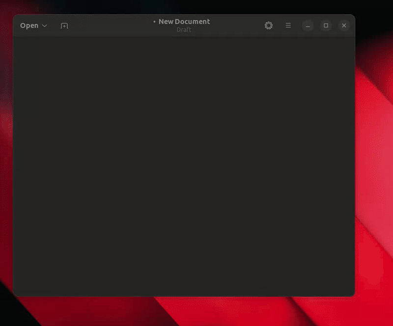

## A Linux Clipboard

A modern Linux clipboard companion with a GTK4 popover UI, emoji picker, and instant auto-paste, built in Rust and inspired by Windows 11's clipboard panel.

## Overview

Super V runs as a background daemon that watches your clipboard, keeps a searchable history of text and images, and exposes the data to a polished GUI. When you pick an entry (or an emoji), the app updates the system clipboard and simulates `Shift+Insert` through `ydotool` so the content lands right where you were typing.



## Features

- **GTK4 UI** with clipboard and emoji tabs, animated reveals, and dark styling.
- **Instant auto-paste** using `ydotool` (Shift+Insert) after selecting an entry.
- **Emoji picker** with live search and thousands of glyphs.
- **Text + image history** (25 most recent entries) with duplicate promotion and per-item delete.
- **IPC layer** over a Unix socket so other programs can control the daemon.
- **Single-instance daemon** enforced with a lock file and automatic cleanup.
- **Tested core** with integration tests for the manager, IPC layer, and history logic.

## Architecture

- **Daemon (`src/services/clipboard_manager.rs`)**: polls the system clipboard, manages history, and listens for commands. Threads communicate through `Arc<Mutex<_>>` and an atomic stop signal.
- **IPC server (`src/services/clipboard_ipc_server.rs`)**: MessagePack-encoded Unix socket protocol supporting `Snapshot`, `Promote`, `Delete`, `DeleteThis`, `Clear`, and `Stop`.
- **GUI (`src/gui/clipboard_gui.rs`)**: GTK4 application that renders the clipboard list, emoji grid, and per-item actions. Uses the IPC layer to stay in sync and `ydotool` to auto-paste.
- **Common types (`src/common.rs`)**: shared error types, constants, and the `ClipboardItem` enum used throughout the project.

## Installation

### Prerequisites

- Linux with systemd (Wayland or X11/XWayland).
- Rust toolchain (stable) and build essentials (`git`, `cmake`, `make`, etc.).
- Ability to run privileged commands once (the installer needs `sudo` for `ydotool`).

### Quick install

```bash
chmod +x install.sh
./install.sh
```

`install.sh` will:

- Build a release binary and strip it.
- Install `super_v` into `/usr/local/bin`.
- Fetch, build, and install `ydotool` if it is missing, then register `ydotoold` as a system service.
- Write the user unit file at `~/.config/systemd/user/super_v.service`.
- Create `/var/log/superv.log`, adjust ownership, and enable lingering so the user service survives logouts.
- Reload both system and user systemd daemons and start the clipboard daemon plus `ydotoold`.

To update, rerun the installer. It rebuilds and redeploys everything.

## Uninstall

```bash
chmod +x uninstall.sh
./uninstall.sh
```

The script stops the user unit, tears down lingering, removes binaries and unit files, cleans the `ydotool` install, and deletes log files.

## Usage

- `super_v start` – launch the daemon (normally handled by systemd).
- `super_v open-gui` – open the clipboard window wherever you invoke it.
- `super_v clean` – clear stale socket/lock files if the daemon crashed.

### GUI workflow

- **Clipboard tab**: click any row to copy it back into the system clipboard and auto-paste. Use the trash icon to delete an entry or the header button to clear everything with an animated wipe.
- **Emoji tab**: type to filter by emoji name, click to copy+paste immediately, and the history records the emoji so it is available in the clipboard tab too.

### Service management

> **Note**: Auto handled by install.sh

```bash
systemctl --user status super_v.service
systemctl --user restart super_v.service
sudo systemctl status ydotoold.service
```

Logs live in `/var/log/superv.log`.

## IPC API

`SOCKET_PATH` is `/tmp/super_v.sock`. Clients talk MessagePack using the `Payload` enum.

```rust
use super_v::services::clipboard_ipc_server::{
   create_default_stream, send_payload, read_payload,
   Payload, IPCRequest, CmdIPC,
};

fn main() -> anyhow::Result<()> {
   let mut stream = create_default_stream()?;
   send_payload(&mut stream, Payload::Request(IPCRequest { cmd: CmdIPC::Snapshot }));

   if let Payload::Response(resp) = read_payload(&mut stream) {
      if let Some(history) = resp.history_snapshot {
         println!("{} items", history.get_items().len());
      } else if let Some(msg) = resp.message {
         eprintln!("daemon replied: {msg}");
      }
   }
   Ok(())
}
```

Supported commands:

- `Snapshot` – return the current history.
- `Promote(usize)` – move the entry at index to the top.
- `Delete(usize)` – remove by index (as displayed in the GUI).
- `DeleteThis(ClipboardItem)` – remove a specific entry by value.
- `Clear` – wipe the history.
- `Stop` – request the daemon to shut down gracefully.

## Development

```text
src/
├── main.rs                     # CLI entry point
├── lib.rs                      # Module glue
├── common.rs                   # Shared constants, errors, clipboard item types
├── history.rs                  # History ring buffer implementation
├── services/
│   ├── clipboard_manager.rs    # Daemon orchestration
│   ├── clipboard_ipc_server.rs # Unix socket + MessagePack protocol
│   └── ydotol.rs               # ydotool integration (Shift+Insert)
└── gui/
   ├── clipboard_gui.rs         # GTK4 application
   └── style.css                # UI styling
tests/
├── history_test.rs
├── ipc_test.rs
└── manager_test.rs
```

Run the suite with `cargo test`. The integration tests are marked `#[serial]` because they exercise the singleton daemon + socket.

## Contributing

Pull requests, bug reports, and feature ideas are welcome:

1. Fork the repo and create a feature branch.
2. `cargo fmt` and `cargo clippy --all-targets` if you touch Rust code.
3. `cargo test` to ensure the suite stays green.
4. Describe user-visible changes (especially anything GUI/IPC related) in the PR body.

Ideas that would help a ton:

- Replace `unwrap()` hotspots with surfaced errors.
- Enhanced tests + more coverage.
- Persist history across restarts.
- Extend format support (rich text, HTML fragments, etc.).
- Extended Emojis (ASCII?)
- Polish the GTK layout for different DPI/scale factors.
- GUI Hiccups/Stutters + More animations.
- Package for your distro of choice.
